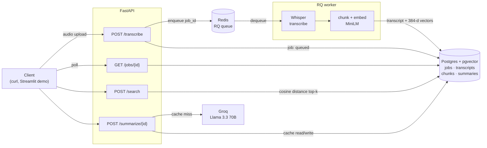

# asr-pipeline

Whisper transcription as a production-shaped service: upload audio, get a
job id back immediately, and poll for a transcript that is automatically
chunked, embedded and indexed for semantic search — with LLM summaries on
top.


> **Status:** active development. The API surface below is implemented and
> tested end to end locally. Public demo and deployment are not live yet —
> see [Deployment](#deployment).

---

## Quick start

```bash
cp .env.example .env            # fill in POSTGRES_USER / PASSWORD / DB
docker compose up -d --build    # API, worker, Postgres+pgvector, Redis
docker compose exec api python -m scripts.create_api_key dev
```

The last command prints an API key once — it is stored only as a SHA-256
hash, so copy it now.

```bash
curl -X POST http://localhost:8080/transcribe \
  -H "X-API-Key: $KEY" -F "audio=@data/samples/sample.wav"
# {"job_id":"…","status":"queued"}

curl http://localhost:8080/jobs/$JOB_ID -H "X-API-Key: $KEY"          # poll until "done"
curl http://localhost:8080/jobs/$JOB_ID/result -H "X-API-Key: $KEY"   # transcript + segments
```

To verify a checkout end to end — build, transcribe, search, summarize,
teardown — run `bash scripts/smoke_test.sh`.

## Architecture



The API never does heavy work. It validates the upload, records a `Job`
row, pushes the id onto Redis and returns `202` — a 30-minute file takes
minutes of CPU, far past any sensible HTTP timeout. A separate worker
process picks the job up, runs Whisper, and in the same transaction writes
the transcript, splits it into overlapping ~45s windows, embeds them, and
stores the vectors. Because indexing happens inside the transaction that
marks the job `done`, a transcript is never visible without its index.

Search embeds the query with the same model and ranks chunks by cosine
distance inside Postgres. Summaries are generated once per transcript and
cached, since the input never changes.

## API

All endpoints except `/`, `/health` and `/metrics` require an `X-API-Key`
header. Jobs are scoped to the key that submitted them: reading someone
else's job returns 404, the same as one that does not exist, so the API
never confirms which ids are real.

| Endpoint | Request | Response |
|---|---|---|
| `POST /transcribe` | multipart `audio` file | `202` · `{job_id, status}` |
| `GET /jobs` | — | recent jobs for this key, newest first |
| `GET /jobs/{id}` | — | `{id, status, error_message, duration}` |
| `GET /jobs/{id}/result` | — | `{transcript_id, full_text, language, segments}` |
| `POST /search` | `{query, top_k, transcript_id?}` | `{query, hits: [{transcript_id, start_sec, end_sec, text, score}]}` |
| `POST /summarize/{transcript_id}` | — | `{transcript_id, cached, model, sections: [{title, start_sec, end_sec, key_points}], meta}` |
| `GET /health` | — | `{status: "ok"}` |
| `GET /metrics` | — | Prometheus text format |

`status` moves `queued → processing → done | failed`. Interactive docs are
at `/docs`.

Every response carries an `X-Request-Id`; the same id appears in every log
line the request produced, **including the worker's**, so one id
reconstructs the whole journey across processes.

## Stack and trade-offs

| Choice | Instead of | Why |
|---|---|---|
| **faster-whisper** | openai-whisper, whisper.cpp | ~4x faster on CPU via CTranslate2, clean Python API, native word timestamps |
| **pgvector** | Qdrant, Pinecone, Weaviate | One datastore instead of two. Job state and vectors live in the same database and the same transaction, so they cannot disagree |
| **all-MiniLM-L6-v2** | all-mpnet-base-v2 | 384 dims, 22MB, fast enough on CPU. Quality is adequate — see [`scripts/search_eval.md`](scripts/search_eval.md) |
| **RQ** | Celery, Arq | The job model here is "run one function, retry never". Celery's broker abstractions and routing buy nothing at this size |
| **Groq + Llama 3.3 70B** | GPT-4o-mini | Free tier good enough for a demo, sub-second latency |
| **Time-based chunking** | fixed character counts | Audio has a time axis; a hit is only useful if it says *when*. ~45s windows with 10s overlap so a thought is not cut in half |
| **Quota in audio minutes** | requests per hour | A 2-hour upload costs 240x what a 30-second one does. Counting requests would price them identically |
| **API keys** | JWT / OAuth | There are no user sessions. A hashed key is the right size of solution |

## Performance

Measured with `scripts/benchmark.sh` against the full compose stack on
**Apple Silicon (Darwin arm64), Docker Desktop, CPU only** — not on
deployed hardware, which will be slower.

| Operation | P50 | P95 | Samples |
|---|---|---|---|
| `POST /transcribe` → `done`, 30s audio | 16.1 s | 30.8 s | 3 |
| `POST /search`, top_k=5 | 58 ms | 236 ms | 9 |

Measured separately on one **60-minute** recording (a Lex Fridman episode),
which is the case that exercises every limit at once:

| | |
|---|---|
| Transcription, end to end | **28 min** (~0.47x real time) |
| Peak worker memory | **1.42 GB** |
| Output | 10,789 words · 1,384 segments · 102 chunks |
| Chunk coverage | full 3,600 s, mean chunk 46.4 s |
| `POST /summarize`, cache miss | 4.1 s · 6,659 input tokens |
| `POST /summarize`, cache hit | **62 ms** |

### Memory: the number that decides your VM size

A 1-hour recording needs **~1.5 GB** in the worker, and Whisper allocates
it in the first minute. In a Docker VM capped at 3.8 GB and shared with
Postgres, the forking worker was OOM-killed 78 seconds in — before
transcribing anything. Size the worker at **2 GB minimum**, which is what
`fly.worker.toml` requests; the API needs a fraction of that.

Reading these honestly: transcription is roughly **0.5–1x real time** on
CPU, and the spread between P50 and P95 is queue wait, not model speed —
with one worker, a job that arrives while another is running waits for it.
Search is fast because the corpus is small and the scan is sequential;
that number will grow with the index until an IVFFlat index is worth
building.

Re-run on your own hardware with:

```bash
ASR_API_KEY=<key> bash scripts/benchmark.sh data/samples/sample.wav
```

## Limitations

Known and deliberate:

- **Rate limiting is post-upload.** The quota check needs the file's
  duration, which is read with `ffprobe` after the bytes have landed. A
  caller over quota is rejected, but only after paying the upload.
- **The audio spool is a shared filesystem.** The API writes the upload
  where the worker reads it. That works under compose via a shared volume;
  across separate hosts it needs object storage. This currently blocks the
  split-app Fly deployment — see [`docs/deploy.md`](docs/deploy.md).
- **English only.** `small.en` is English-specific; a multilingual model
  means changing `WHISPER_MODEL` and re-testing chunk quality.
- **CPU only.** No GPU path. Transcription is roughly real-time-ish on
  Apple Silicon and slower on a small shared cloud VM.
- **No streaming.** Transcription is batch; there is no partial-result API.
- **No diarization.** No speaker labels.
- **Sequential vector scan.** Exact and fast to ~10k chunks. An IVFFlat
  index needs data present at creation to train its clusters, so it is a
  post-backfill step, noted in `app/db/models.py`.
- **Groq free tier rate-limits** at roughly 30 requests/minute. Fine for a
  demo, not for load testing.
- **Long transcripts are thinned before summarizing.** Past ~10k tokens
  the transcript sent to the LLM keeps every Nth segment rather than all
  of them, because a multi-hour recording exceeds the free tier's token
  budget outright. Coverage of the full running time is preserved and the
  response reports `transcript_thinned`, but the reading is coarser. A
  1-hour episode keeps 692 of 1,384 segments.
- **A killed worker is only detected where there is a work-horse.** On
  Linux an OOM-killed job is marked `failed` within seconds. Under
  macOS's non-forking `SimpleWorker` the job dies with the process, and
  the startup reaper is the only backstop.

## Development

```bash
uv sync
docker compose up -d postgres redis
uv run alembic upgrade head
uv run fastapi dev app/main.py            # terminal 1
uv run python -m app.workers.run          # terminal 2 — required
```

The worker is a **separate process**; without it uploads sit in `queued`
forever.

```bash
uv run ruff check .   # lint
uv run pytest         # unit tests, no services required
```

See [CONTRIBUTING.md](CONTRIBUTING.md) for conventions and the gotchas
worth knowing (macOS fork behaviour, Alembic and pgvector, layering
rules).

## Deployment

Fly.io configs for the API (`fly.api.toml`) and worker
(`fly.worker.toml`) are in the repo, along with a runbook in
[`docs/deploy.md`](docs/deploy.md). Read the runbook first: the shared
audio spool noted above has to be resolved before the two-app split will
work.

## Related work

- [**asr-attack**](https://github.com/AndreaAresu) — adversarial robustness
  toolkit for speech recognition: attack types, model families, and a
  Sardinian ASR paper. This repository is its production-side sibling: one
  asks how ASR breaks, the other how you run it as a service.

## License

MIT — see [LICENSE](LICENSE).
