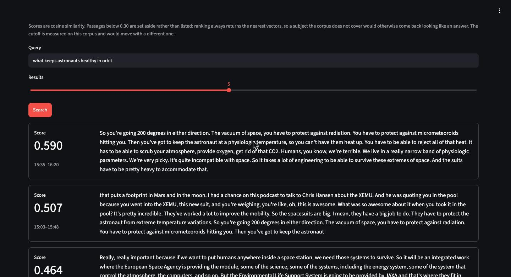
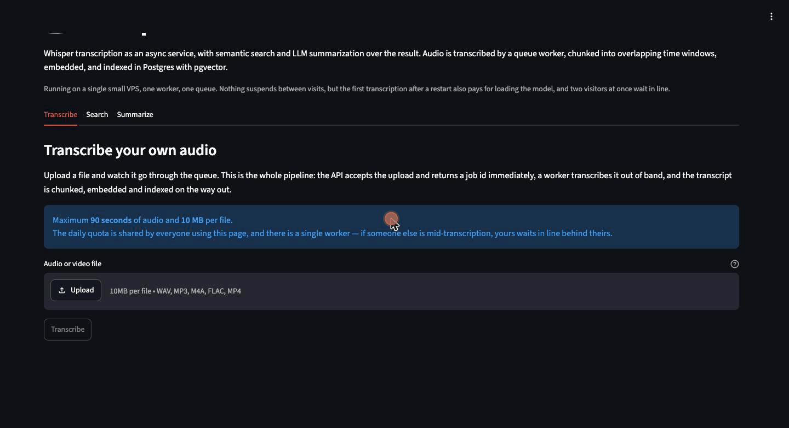
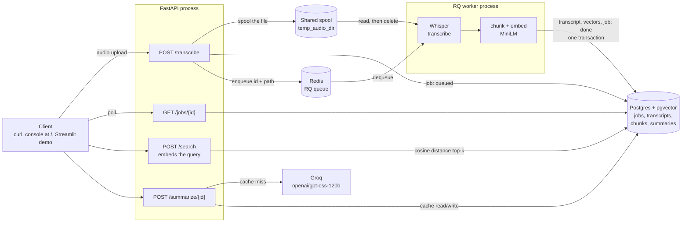
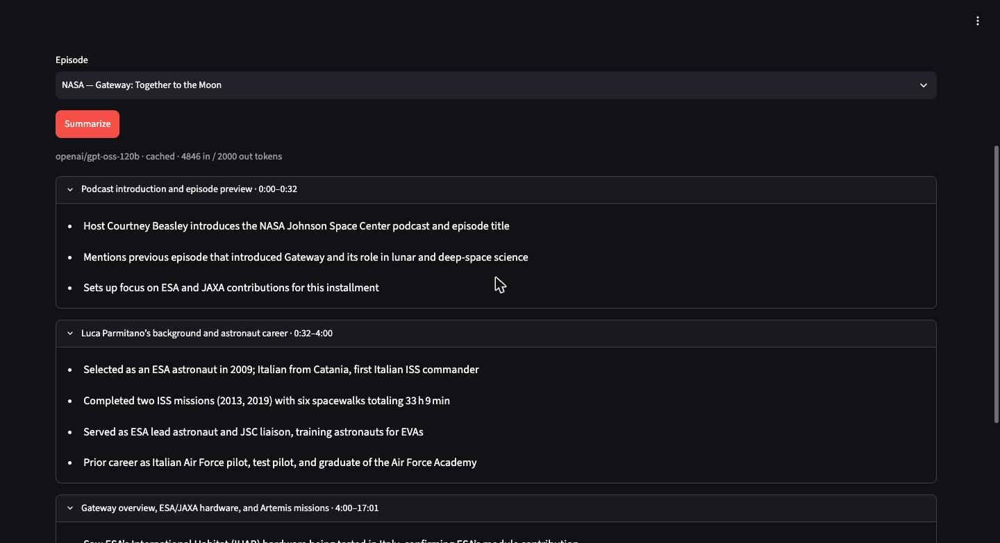
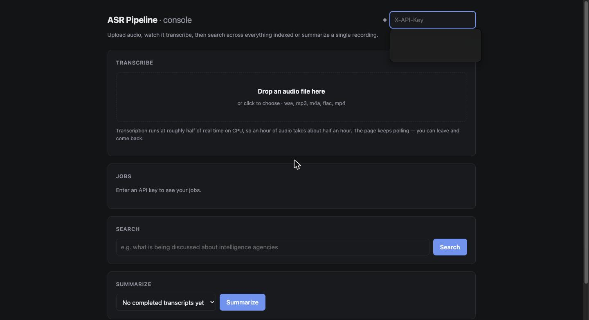

# asr-pipeline

**Upload a recording, get a searchable transcript.** A FastAPI service takes
audio, returns a job id immediately, and transcribes it out of band with
Whisper. On the way out every transcript is chunked into overlapping time
windows, embedded, and stored in Postgres, so the whole archive answers
questions in plain language and any recording can be summarized into
timestamped sections.

**[Try the live demo](https://demo.159-195-250-205.sslip.io)**: no signup, no
key. Search 67 minutes of indexed NASA podcasts, or upload your own clip and
watch it go through. Also live: the [API and its browser
console](https://api.159-195-250-205.sslip.io), with [OpenAPI
docs](https://api.159-195-250-205.sslip.io/docs).



> The query above never says "radiation", "CO2" or "spacesuit". It matches on
> meaning, and every hit carries the timestamp where it was said.



## How it works

Transcription is minutes of CPU, far past any sensible HTTP timeout, so the
request that starts it does not wait for it.



The API validates the upload, spools it to a directory the worker can also
read, writes a `Job` row, pushes the id onto Redis and returns `202`. A
separate worker process runs Whisper, then **in the same transaction that
marks the job `done`** it writes the transcript, splits it into 45-second
windows with 10 seconds of overlap, embeds them and stores the vectors. A
transcript is therefore never visible without its index. The worker deletes
the spooled file whether the job succeeded or not.

Search embeds the query with the same model, in the API process, and ranks by
cosine distance inside Postgres. Summaries are generated once per transcript
and cached, since the input never changes.

That shared spool is the one piece of coupling in the diagram, and it is why
the API and the worker run on the same host. See
[`docs/deploy.md`](docs/deploy.md).

## Retrieval quality

Semantic search is the part of a project like this most easily claimed and
least often measured. [`scripts/search_eval.md`](scripts/search_eval.md)
carries two dated runs against a fixed 10-query set, graded by hand: five
queries name entities the audio contains, three name broad themes it covers
without saying so, and two are about subjects it has never heard of.

Run 2, over the 109 chunks of the seeded corpus:

| | |
|---|---|
| Episode routing | **15 of 15** top-3 hits from the five specific queries landed in the right recording |
| Rank order | 9 of 10 queries put the passage a human would pick first in position 1 |
| In-domain vs out-of-distribution | worst in-domain top-1 **0.514**, best out-of-distribution **0.188**, a factor of 2.7 |

Routing is the check that needs more than one recording, and the one that
matters for a multi-recording index. The question is not "did it find
something plausible" but "did it find it in the document that actually holds
the answer".

The finding worth more than the scores: **Run 1's score bands did not survive
the corpus growing.** At one chunk, specific and generic queries separated
cleanly. At 109 they overlap almost completely, because a broad theme now
finds a genuinely good passage. Out-of-distribution scores rose from negative
to 0.10-0.19 for the same reason, since more candidates mean a better nearest
neighbour for any query at all. A relevance threshold hard-coded today drifts
as the index grows, so the demo's 0.30 cutoff is recorded together with the
measurement it came from.



## The corpus

Three episodes of NASA's *Houston We Have a Podcast*, 66 min 54 s of audio,
one `small.en` pass, 109 chunks. It serves both the evaluation and the demo,
so the two cannot drift apart.

- [Gateway: Together to the Moon](https://www.nasa.gov/podcasts/houston-we-have-a-podcast/gateway-together-to-the-moon/)
- [Astronaut and Microbiologist](https://www.nasa.gov/podcasts/houston-we-have-a-podcast/astronaut-and-microbiologist/)
- [Apollo 11 to Now](https://www.nasa.gov/podcasts/houston-we-have-a-podcast/apollo-11-to-now/)

Public domain as works of a US government agency. NASA asks to be credited,
which is what this section does; its insignia is not public domain and is not
used here. The indexed rows are committed as `data/seed/nasa_corpus.sql` and
regenerated by `scripts/dump_seed.sh`.

## Run it

```bash
cp .env.example .env            # fill in POSTGRES_USER / PASSWORD / DB
docker compose up -d --build    # API, worker, Postgres+pgvector, Redis
docker compose exec api python -m scripts.create_api_key dev
```

The last command prints an API key once. Only its SHA-256 is stored, so copy
it now. Then open **http://localhost:8080/** for the built-in console, or:

```bash
curl -X POST http://localhost:8080/transcribe \
  -H "X-API-Key: $KEY" -F "audio=@/path/to/recording.mp3"   # -> {"job_id": "..."}
curl http://localhost:8080/jobs/$JOB_ID -H "X-API-Key: $KEY"          # poll
curl http://localhost:8080/jobs/$JOB_ID/result -H "X-API-Key: $KEY"   # transcript
```

Audio is not committed, since `data/samples/` is gitignored, so bring your
own: `.wav`, `.mp3`, `.m4a`, `.flac` or `.mp4`, checked by filename.

`bash scripts/smoke_test.sh /path/to/recording.mp3` runs the whole thing:
build, transcribe, search, summarize, teardown. It needs `jq`.



<details>
<summary><b>Two UIs and two ports, both on purpose</b></summary>

<br>

`app/web/index.html` is the console above, served by the API at `/`. It is one
static file with no build step and no second process, and it is what you get
by running the stack. `demo/app.py` is the Streamlit app behind the public
link, with its own compose service and its own image, written for a visitor
who is not going to read an API reference.

Port **8080** is compose. Running the API directly on the host with
`uv run fastapi dev app/main.py` listens on **8000**. Both appear in this
repo and neither is wrong.

</details>

<details>
<summary><b>Developing without Docker</b></summary>

<br>

```bash
uv sync
docker compose up -d postgres redis
uv run alembic upgrade head
uv run fastapi dev app/main.py            # terminal 1, serves on :8000
uv run python -m app.workers.run          # terminal 2, required

uv run ruff check .                       # lint
uv run pytest                             # unit tests, no services needed
```

The worker is a **separate process**. Without it, uploads sit in `queued`
forever. See [CONTRIBUTING.md](CONTRIBUTING.md) for the gotchas worth knowing:
macOS fork behaviour, Alembic and pgvector, layering rules.

</details>

## Numbers

Measured on the deployed VPS, 4 vCore, CPU only, `base.en`:

| | |
|---|---|
| 30 s of audio to `done` | **19.7 s** P50 |
| At the 90 s cap, what a visitor waits | **~37 s** warm, 42 s cold |
| `POST /search`, top_k=5 | **62 ms** P50 |
| `POST /summarize`, cache hit | **37 ms** |
| Peak worker memory | **1.30 GB**, so size the worker at 2 GB |
| Container image | **3.17 GB** |

Full tables, both machines, and the 60-minute run are in
[`docs/performance.md`](docs/performance.md).

## What it does not do

CPU only, English only, no diarization, no streaming, no partial results. The
vector scan is sequential: exact, and fast to roughly 10k chunks. Rate
limiting is enforced after the upload lands, because the quota is counted in
audio minutes and that needs `ffprobe`. `/search` and `/summarize` check no
ownership, so any valid key reads the whole index.

The complete list with the reasoning is in
[`docs/design.md`](docs/design.md), which also holds the API reference and
the stack trade-offs.

## Deployment

One VPS running this repo's `compose.yaml`, with Caddy on the host
terminating TLS, and the API and the demo on separate `sslip.io` hostnames so
no domain is needed. The runbook, including why the API and the worker are
*not* on separate machines, is in [`docs/deploy.md`](docs/deploy.md).

## License

MIT, see [LICENSE](LICENSE). Built with `uv` on Python 3.13.
