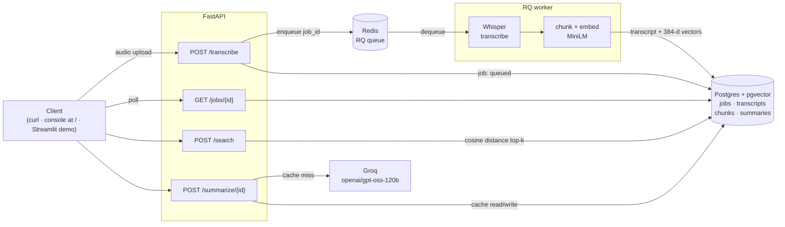

# asr-pipeline

Whisper transcription as a production-shaped service: upload audio, get a
job id back immediately, and poll for a transcript that is automatically
chunked, embedded and indexed for semantic search — with LLM summaries on
top.


> **Status: live, and you can use it without asking anyone for a key.**
>
> - **Demo** — **https://demo.159-195-250-205.sslip.io** — search the
>   indexed corpus, read a generated summary, or upload your own clip and
>   watch it go through. Start here.
> - **API** — **https://api.159-195-250-205.sslip.io** — the browser
>   console at `/`, OpenAPI docs at `/docs`.
>
> One small VPS running the `compose.yaml` in this repo, behind Caddy. The
> indexed corpus is three public-domain NASA podcast episodes. Uploads are
> open to anyone, capped at 90 seconds and 10 MB, on a shared key with a
> daily quota — the caps exist because a visitor waits through the
> transcription on a CPU, about 37 seconds at the cap.

---

## Quick start

```bash
cp .env.example .env            # fill in POSTGRES_USER / PASSWORD / DB
docker compose up -d --build    # API, worker, Postgres+pgvector, Redis
docker compose exec api python -m scripts.create_api_key dev
```

The last command prints an API key once — it is stored only as a SHA-256
hash, so copy it now.

Audio is not committed — `data/samples/` is gitignored, so a fresh clone
has no file to send. Point the upload at any recording of your own:
`.wav`, `.mp3`, `.m4a`, `.flac` or `.mp4`, checked by filename rather than
by content.

```bash
curl -X POST http://localhost:8080/transcribe \
  -H "X-API-Key: $KEY" -F "audio=@/path/to/your-recording.mp3"
# {"job_id":"…","status":"queued"}

curl http://localhost:8080/jobs/$JOB_ID -H "X-API-Key: $KEY"          # poll until "done"
curl http://localhost:8080/jobs/$JOB_ID/result -H "X-API-Key: $KEY"   # transcript + segments
```

To verify a checkout end to end — build, transcribe, search, summarize,
teardown — run `bash scripts/smoke_test.sh /path/to/your-recording.mp3`.
It needs `jq`, and it will tell you which audio file it could not find
rather than failing halfway.

**Port 8080 is the compose port.** Running the API directly on the host
(`uv run fastapi dev app/main.py`, see [Development](#development)) listens
on **8000** instead. Both appear in this repo — the quick start above is
compose, `scripts/search_eval.md` is host — and neither is wrong; check
which one you are running before assuming a connection refused is a bug.

### Two browser UIs, and they are not the same thing

- **`app/web/index.html`** — the console the API itself serves at `/`. One
  static file, no build step and no second process, covering upload →
  poll → transcript → search → summarize. Bring the stack up and it is
  there; this is the one to use when running the project locally.
- **`demo/app.py`** — the Streamlit app behind the public link above. Its
  own compose service and its own image, talking to the API over the
  network. It exists for a visitor who is not going to read an API
  reference: it states the upload caps before the file picker and holds
  their hand through the wait.

## Architecture



The API never does heavy work. It validates the upload, records a `Job`
row, pushes the id onto Redis and returns `202` — a 30-minute file takes
minutes of CPU, far past any sensible HTTP timeout. A separate worker
process picks the job up, runs Whisper, and in the same transaction writes
the transcript, splits it into overlapping ~45s windows, embeds them, and
stores the vectors. Because indexing happens inside the transaction that
marks the job `done`, a transcript is never visible without its index.

Search embeds the query with the same model and ranks chunks by cosine
distance inside Postgres. Summaries are generated once per transcript and
cached, since the input never changes.

## API

All endpoints except `/`, `/health` and `/metrics` require an `X-API-Key`
header. Jobs are scoped to the key that submitted them: reading someone
else's job returns 404, the same as one that does not exist, so the API
never confirms which ids are real.

| Endpoint | Request | Response |
|---|---|---|
| `POST /transcribe` | multipart `audio` file | `202` · `{job_id, status}` |
| `GET /jobs` | — | recent jobs for this key, newest first |
| `GET /jobs/{id}` | — | `{id, status, error_message, duration}` |
| `GET /jobs/{id}/result` | — | `{transcript_id, full_text, language, segments}` |
| `POST /search` | `{query, top_k, transcript_id?}` | `{query, hits: [{transcript_id, start_sec, end_sec, text, score}]}` |
| `POST /summarize/{transcript_id}` | — | `{transcript_id, cached, model, sections: [{title, start_sec, end_sec, key_points}], meta}` |
| `GET /health` | — | `{status: "ok"}` |
| `GET /metrics` | — | Prometheus text format |

`status` moves `queued → processing → done | failed`. Interactive docs are
at `/docs`.

Every response carries an `X-Request-Id`; the same id appears in every log
line the request produced, **including the worker's**, so one id
reconstructs the whole journey across processes.

## Retrieval quality

Semantic search is the part of this project most easily claimed and least
often measured, so it is measured: [`scripts/search_eval.md`](scripts/search_eval.md)
carries two dated runs against a fixed 10-query set — five naming entities
the audio actually contains, three broad themes it covers without naming,
two topics it has never heard of — with every hit graded by hand.

Run 2 is the one that counts, over **109 chunks from three deliberately
disjoint recordings** — the corpus the public demo searches, so the numbers
below describe what a reader can go and query themselves.

| | |
|---|---|
| Episode routing | **15 of 15** top-3 hits from the five specific queries landed in the right recording |
| Rank order | 9 of 10 queries put the passage a human would pick first in position 1 |
| In-domain vs out-of-distribution | worst in-domain top-1 **0.514**, best out-of-distribution **0.188** — a factor of 2.7 |

Routing is the check that needs more than one recording, and it is the one
that matters for a multi-recording index: not "did it find something
plausible", but "did it find it in the document that actually contains the
answer".

Two findings worth more than the scores. Run 1's score bands did **not**
survive the corpus growing: specific and generic queries separated cleanly
at 1 chunk and overlap almost completely at 109, because a broad theme now
finds a genuinely good passage. And out-of-distribution scores rose from
negative to 0.10–0.19 for the same reason — 109 candidates contain a better
nearest neighbour for *any* query than 1 did. A relevance threshold
hard-coded today drifts as the index grows; the demo's 0.30 cut-off is
recorded with the measurement it came from, not picked by feel.

Re-run it with `bash scripts/search_eval.sh` against your own index.

### The corpus

Three episodes of NASA's *Houston We Have a Podcast* — 66 min 54 s of
audio, transcribed once with `small.en` and indexed as 109 chunks, serving
both the evaluation and the demo so the two cannot drift apart:

- [Gateway: Together to the Moon](https://www.nasa.gov/podcasts/houston-we-have-a-podcast/gateway-together-to-the-moon/)
- [Astronaut and Microbiologist](https://www.nasa.gov/podcasts/houston-we-have-a-podcast/astronaut-and-microbiologist/)
- [Apollo 11 to Now](https://www.nasa.gov/podcasts/houston-we-have-a-podcast/apollo-11-to-now/)

Public domain as works of a US government agency. NASA asks to be credited,
which is what this section does; the NASA insignia is *not* public domain
and is not used here. The indexed rows are committed as
`data/seed/nasa_corpus.sql` and regenerated with `scripts/dump_seed.sh`.

## Stack and trade-offs

| Choice | Instead of | Why |
|---|---|---|
| **faster-whisper** | openai-whisper, whisper.cpp | ~4x faster on CPU via CTranslate2, clean Python API, native word timestamps |
| **pgvector** | Qdrant, Pinecone, Weaviate | One datastore instead of two. Job state and vectors live in the same database and the same transaction, so they cannot disagree |
| **all-MiniLM-L6-v2** | all-mpnet-base-v2 | 384 dims, 22MB, fast enough on CPU. Adequate is not an opinion here: 15/15 correct episode routing over 109 chunks, graded by hand in [`scripts/search_eval.md`](scripts/search_eval.md) |
| **RQ** | Celery, Arq | The job model here is "run one function, retry never". Celery's broker abstractions and routing buy nothing at this size |
| **Groq, model from config** | GPT-4o-mini | Free tier good enough for a demo, sub-second latency. The model is `SUMMARIZE_MODEL`, not a constant, because hosted providers retire models: this was built against Llama 3.3 70B, which Groq withdrew mid-project. It runs `openai/gpt-oss-120b` today |
| **Time-based chunking** | fixed character counts | Audio has a time axis; a hit is only useful if it says *when*. ~45s windows with 10s overlap so a thought is not cut in half |
| **Quota in audio minutes** | requests per hour | A 2-hour upload costs 240x what a 30-second one does. Counting requests would price them identically |
| **API keys** | JWT / OAuth | There are no user sessions. A hashed key is the right size of solution |

## Performance

Measured with `scripts/benchmark.sh` against the full compose stack, on
both machines this project runs on.

**Apple Silicon (Darwin arm64), Docker Desktop, CPU only**, `small.en`:

| Operation | P50 | P95 | Samples |
|---|---|---|---|
| `POST /transcribe` → `done`, 30s audio | 16.1 s | 30.8 s | 3 |
| `POST /search`, top_k=5 | 58 ms | 236 ms | 9 |

**The deployed VPS** — netcup VPS Lite 2, 4 vCore, 8 GB, `base.en`, which
is the smaller model the public demo runs:

| Operation | P50 | P95 | Samples |
|---|---|---|---|
| `POST /transcribe` → `done`, 30s audio | 19.7 s | 19.8 s | 3 |
| `POST /transcribe` → `done`, 85s audio | 36.2 s | 36.3 s | 3 |
| `POST /search`, top_k=5 | 62 ms | 296 ms | 9 |
| `POST /summarize`, cache miss | 1.6 s | — | 1 |
| `POST /summarize`, cache hit | 37 ms | 38 ms | 3 |

Two numbers from that machine that are easy to guess wrong. **Cold start
costs 4.5 s, not 30**: the first job after a worker restart took 24.1 s
against 19.6 s warm, because the model weights sit on the `hf_cache` volume
and are not re-downloaded. And **peak worker memory was 1.30 GB** with
`base.en` on short clips, against 1.42 GB for `small.en` on an hour of
audio — the same order of magnitude, so the 2 GB floor below still holds.

A visitor uploading at the 90-second cap therefore waits about **37 s warm,
42 s cold**. That, not spare CPU, is what the cap is set against.

Measured separately on Apple Silicon on one **60-minute** recording, which
is the case that exercises every limit at once (a podcast episode used for
load characterisation only — it is not part of the indexed corpus above):

| | |
|---|---|
| Transcription, end to end | **28 min** (~0.47x real time) |
| Peak worker memory | **1.42 GB** |
| Output | 10,789 words · 1,384 segments · 102 chunks |
| Chunk coverage | full 3,600 s, mean chunk 46.4 s |
| `POST /summarize`, cache miss | 4.1 s · 6,659 input tokens |
| `POST /summarize`, cache hit | **62 ms** |

### Memory: the number that decides your VM size

A 1-hour recording needs **~1.5 GB** in the worker, and Whisper allocates
it in the first minute. In a Docker VM capped at 3.8 GB and shared with
Postgres, the forking worker was OOM-killed 78 seconds in — before
transcribing anything. Size the worker at **2 GB minimum**, which is what
`fly.worker.toml` requests; the API needs a fraction of that.

Reading these honestly: transcription runs at roughly **0.4–0.7x real
time** on the deployed CPU with `base.en` — a clip costs less wall time
than its own duration, but the fixed overheads dominate on short files,
which is why 30 s costs 19.7 s and 85 s only 36.2 s. On Apple Silicon with
the larger `small.en` it is 0.47x. The spread between P50 and P95 is queue
wait, not model speed: with one worker, a job that arrives while another is
running waits for it. Search is fast because the corpus is small and the
scan is sequential; that number will grow with the index until an IVFFlat
index is worth building.

Re-run on your own hardware with:

```bash
ASR_API_KEY=<key> bash scripts/benchmark.sh /path/to/your-recording.mp3
```

It needs `jq` on the machine you run it from, which is not in the image.

## Limitations

Known and deliberate:

- **Rate limiting is post-upload.** The quota check needs the file's
  duration, which is read with `ffprobe` after the bytes have landed. A
  caller over quota is rejected, but only after paying the upload. The
  size cap is the exception and runs *while* the bytes arrive, because
  buffering an arbitrary body first is how you get asked to hold it in
  memory.
- **The public demo is capped hard, and the caps are deployment config,
  not code.** `MAX_UPLOAD_MB=10` and `MAX_AUDIO_SECONDS=90` on the
  deployment; both default to permissive (500 MB, no duration limit) so
  that indexing a long recording locally still works, and `0` disables
  either check. A rejected upload gets `413` with the measured value and
  the limit in the message.
- **The demo runs on one shared API key.** Everyone who opens the public
  link submits under the same key against one daily audio-minute quota, so
  a visitor can exhaust it for everyone until the 24-hour window rolls.
  `/search` does not filter by key either, so an uploaded file joins the
  index the next visitor searches. Both are fine at demo traffic and would
  not be fine at real traffic.
- **Ownership stops at `/jobs`.** A job is readable only by the key that
  submitted it, and that is enforced. `/search` and `/summarize` take a
  `transcript_id` and check no such thing: any valid key can search the
  whole index and summarize any transcript. That is deliberate — it is
  what makes the demo corpus queryable by a visitor whose own key owns
  none of it — but it is a property to know before pointing a second
  tenant at this.
- **The audio spool is a shared filesystem.** The API writes the upload
  where the worker reads it. That works under compose via a shared volume;
  across separate hosts it needs object storage, which is not implemented.
  It is the reason the deployment is a single host rather than split
  API/worker machines — see [`docs/deploy.md`](docs/deploy.md).
- **English only.** Both models used here are English-specific —
  `small.en` for the indexed corpus, `base.en` on the deployment, where a
  visitor is waiting. A multilingual model means changing `WHISPER_MODEL`
  and re-testing chunk quality; nothing else in the pipeline assumes
  English.
- **CPU only.** No GPU path, and the numbers above are what that costs:
  0.47x real time with `small.en` on Apple Silicon, 0.4–0.7x with
  `base.en` on the VPS. Acceptable for a queue-backed service, not for
  anything interactive.
- **No streaming.** Transcription is batch; there is no partial-result API.
- **No diarization.** No speaker labels.
- **Sequential vector scan.** Exact and fast to ~10k chunks. An IVFFlat
  index needs data present at creation to train its clusters, so it is a
  post-backfill step, noted in `app/db/models.py`.
- **Groq free tier rate-limits** at roughly 30 requests/minute. Fine for a
  demo, not for load testing.
- **Long transcripts are thinned before summarizing.** Past ~10k tokens
  the transcript sent to the LLM keeps every Nth segment rather than all
  of them, because a multi-hour recording exceeds the free tier's token
  budget outright. Coverage of the full running time is preserved and the
  response reports `transcript_thinned`, but the reading is coarser. A
  1-hour episode keeps 692 of 1,384 segments.
- **A killed worker is only detected where there is a work-horse.** On
  Linux an OOM-killed job is marked `failed` within seconds. Under
  macOS's non-forking `SimpleWorker` the job dies with the process, and
  the startup reaper is the only backstop.

## Development

```bash
uv sync
docker compose up -d postgres redis
uv run alembic upgrade head
uv run fastapi dev app/main.py            # terminal 1 — serves on :8000
uv run python -m app.workers.run          # terminal 2 — required
```

The worker is a **separate process**; without it uploads sit in `queued`
forever.

```bash
uv run ruff check .   # lint
uv run pytest         # unit tests, no services required
```

See [CONTRIBUTING.md](CONTRIBUTING.md) for conventions and the gotchas
worth knowing (macOS fork behaviour, Alembic and pgvector, layering
rules).

## Deployment

One VPS running this repo's `compose.yaml`, with Caddy on the host
terminating TLS in front of it — API and browser console on one hostname,
the Streamlit demo on another, both on `sslip.io` so no domain is needed.
The runbook, including why the API and worker are *not* on separate
machines, is in [`docs/deploy.md`](docs/deploy.md).

The image is **3.17 GB**, one image serving both the API and the worker.
Most of it is unavoidable — CPU torch is 750 MB before faster-whisper and
sentence-transformers are counted — but it was 5.05 GB until the `uv`
download cache was cleaned in the same layer that created it, and 11.6 GB
before torch was pinned to the CPU wheel index. Both are documented as
diagnostics in [`docs/deploy.md`](docs/deploy.md), because the size is the
first thing that tells you the build went wrong.

`fly.api.toml` and `fly.worker.toml` are still in the repo. They describe
the two-app deployment this started as, which the shared audio spool noted
above makes unworkable without object storage; they are a record of that
design rather than a second way to deploy.

## Related work

- [**asr-attack**](https://github.com/AndreaAresu) — adversarial robustness
  toolkit for speech recognition: attack types, model families, and a
  Sardinian ASR paper. This repository is its production-side sibling: one
  asks how ASR breaks, the other how you run it as a service.

## License

MIT — see [LICENSE](LICENSE).
